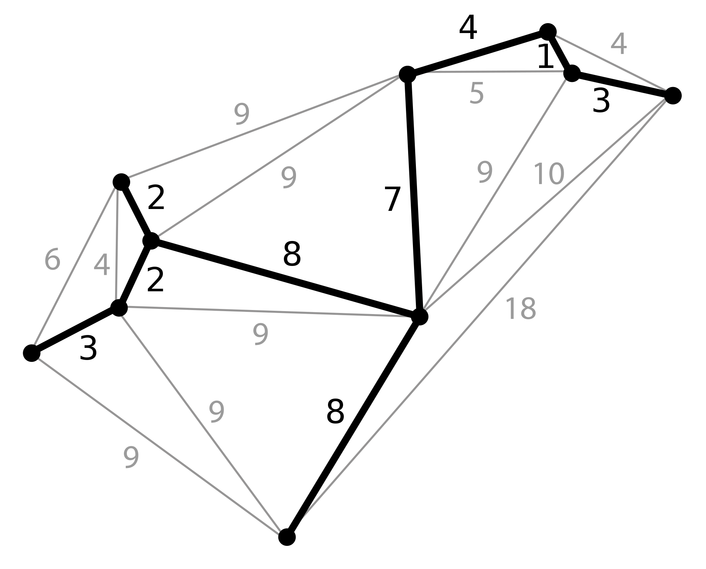

## Arbre :
Un arbre est un graphe connexe qui ne possède pas de cycle.

***Propriétés/Théorèmes :***
***Les Propriétés suivantes sont équivalentes (elles définissent des arbres)*** :
1. $G$ est connexe et sans cycle.
2. $G$ est connexe et $|R|=|N|-1$
3. $G$ est sans cycle et $|R|=|N|-1$ 
4. $G$ est sans cycle et lui ajouter une arête crée un et un seul cycle.
5. $G$ est connexe et supprimer une arête quelconque le déconnecte.
6. Deux nœuds distincts de $G$ sont reliés par un et un seul chemin (et $G$ est sans boucle)

---

## Feuille :
Soit $G=(N,R)$ un arbre. On dit qu’un nœud $n\in N$ est une feuille de $G$ si $\text{deg}(n)=1$.

***Propriétés/Théorèmes :***
1. Les extrémités du chemin le plus long dans un arbre sont des feuilles de degré 1. Preuve : 
   Soit $c=(n_{1},n_{2},\dots,n_{m})$ un chemin de longueur maximale dans $G$ (ce chemin n’est pas nécessairement unique, mais il en existe au moins un). On voit que $\text{deg}(n_{1}) \geq 1$ puisque $n_{1}$ est adjacent à $n_{2}$. Si $n_{1}$ était de degré strictement supérieur à $1$, il devrait exister un nœud $n$ adjacent à $n_{1}$ et distinct de $n_{2}$. Si $n$ se trouve sur le chemin défini plus haut, alors $G$ possède un cycle, ce qui contredit le fait que $G$ est un arbre. Si $n$ ne se trouve pas sur le chemin défini plus haut, alors $c$ peut être étendu en le préfixant par $n$, ce qui contredit l’hypothèse que $c$ est un chemin de longueur maximale. On en conclut que $\text{deg}(n_1)=1$. Le même raisonnement s’applique à $n_{m}$, et on a donc identifié deux nœuds de degré $1$.

---

## Arbre sous-tendant
L’arbre $G'=(N',R')$ est un arbre sous-tendant le graphe $G=(N,R)$ si $N=N'$ et $R' \subseteq R$

***Propriétés/Théorèmes :***
1. $G$ est connexe $\Leftrightarrow G$ possède un arbre sous-tendant
2.

---

## Arbre sous-tendant de poids minimum
$A$ est un arbre sous-tendant de poids minimum de $G$ ssi $A$ sous-tend $G$ et tout arbre $A'$ sous-tendant $G$ est tel que $c(A)\leq c(A')$.

***Exemple(s)***
1.

---
