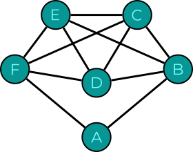
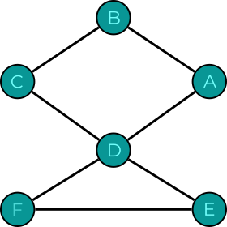

# <u>Notions de Base :</u>

## Nœud/Sommet/Point :
Unité fondamentale d'un graphe

***Propriétés/Théorèmes :***
1. Deux sommets sont voisins s'ils sont reliés par une arête.
2. Deux sommets sont indépendants s'ils ne sont pas voisins.
3. Le ***degré*** d'un sommet est le nombre d'arêtes incidentes à ce sommet les boucles comptant double.

---
## Graphe :
Un graphe est un triple $G=(N,R,I)$ :
- $N :$ ensemble fini nœuds notés $(i,j,k,\dots)$
- $R :$ ensemble fini d'arêtes notées ($\alpha,\beta,\boldsymbol{\gamma}\dots$)
- $I :$ une relation d'incidence $\subset N\times R$ telle que toute arête est incidente à 1 ou 2 nœuds (cette relation est généralement sous-entendue pour un graphe donné)

***Propriétés/Théorèmes :***
1. Un graphe $G$ est dit d'ordre $n$ si $|N|=n$

---

## Arête/Lien/Ligne :
liaison entre deux sommets d'un graphe

***Propriétés/Théorèmes :***
1. Une arrête $\alpha \in R$ est une boucle si $|\{i|(i,\alpha)\in I\}\mid=1$ :
  1. $(i,\alpha) \in I$ : Indique que la paire $(i,\alpha)$ est un élément de l'ensemble $I$.
  2. $i|(i,\alpha) \in I$ : Désigne l'ensemble des $i$ tels que $(i,\alpha)$ ce trouve dans l'ensemble des relations d'incidence c'est à dire l'ensemble des connexions arête nœud.
  3. $|\{i|(i,\alpha)\in I \} \mid$ Désigne la taille de l'ensemble susmentionné.

---

# <u>Notions Dérivées :</u>

## Parcours/Chaîne :
Un parcours $P$ de longueur $k$ dans $G$ est une suite alternée $P:=(i_{0}, \alpha_{1}, i_{1}, \alpha_{2}, i_{2}, \dots, \alpha_{k}, i_{k})$ de $k+1$ nœuds et $k$ arêtes de $G$.

***Propriétés/Théorèmes :***
1. Un parcours est dit fermé si $i_{0}=i_{k}$ et ouvert sinon.

---

## Piste/Chaîne simple :
Une piste est un parcours dont les arêtes sont distinctes

---

## Chemin/Chaîne élémentaire (Définition de chemin de LEPL1108)) :
Un chemin est un parcours ouvert dont tous les nœuds sont distincts.

---

## Cycle/Circuit (Définition d'un cycle plus répandue dans la littérature et plus utile à mon avis) :
Un cycle est une suite d'arêtes consécutives distinctes (chaine simple) dont les deux sommets extrémités sont identiques.

---

## Cycle (Définition donnée dans LEPL1108) :
Un parcours dont tous les nœuds et arêtes sont distincts, à l’exception du premier et du dernier nœud.

---

## Isthme :
Considérons un graphe connexe $G=(N,R)$. Une arête $\alpha \in R$ est appelée un isthme de $G$ si la présence de $ \alpha$ est indispensable à la connexité, c’est-à-dire si le graphe partiel $G_{\alpha}^{*} :=(N,R \setminus \{\alpha \})$ n’est pas connexe.

---

## Graphe Simple :
Un graphe est simple si il n’a ni boucle ni nœuds reliés par des arêtes
multiples. $\alpha=\{i,j\}$ identifie alors l'unique arête telle que $(i,\alpha)\in I$ et $(j,\alpha) \in I$

***Propriétés/Théorèmes :***
1. Un graphe simple est biparti si et seulement s'il ne possède aucun cycle de longueur impaire (explication de la partie nécessaire de cette équivalence : Si on imagine un cycle de longueur 3, on place un nœud dans $U$ et dans $V$, où place-t-on le troisième nœud ? Dans les 2 cas on aura une arête avec ses extrémités dans un même ensemble  )
2.  Un graphe simple non orienté d'ordre $n$ a au maximum $\frac{n(n-1)}{2}$ arêtes

---

## Graphe Connexe :
Un graphe est connexe si il existe un parcours reliant toute paire de nœuds.

---

## Graphe Biparti :
Un graphe est dit biparti si son ensemble de sommets peut être divisé en deux sous-ensembles disjoints $U$ et $V$ tels que chaque arête ait une extrémité dans $U$ et l'autre dans $V$. 

---

## Parcours/Chaine eulérien(ne) :
Un parcours qui passe par toutes les arêtes, une seule fois.

***Propriétés/Théorèmes :***
1. Un graphe connexe a un parcours eulérien si il possède 0 ou 2 arêtes de degré impair.

---

## Cycle/Circuit/Tournée Eulérien(ne) :
Parcours eulérien qui revient au sommet/nœud de départ (ici on parle de cycle définit comme une chaîne simple/piste fermée).

---

## Graphe Eulérien :
Graphe possédant au moins un cycle eulérien (ici on parle de cycle définit comme une chaîne simple/piste fermée).

***Exemple(s) :***
1.

2.

  
***Propriétés/Théorèmes :***
1. Un graphe connexe dont les nœuds sont tous de degré pair est un graphe eulérien et inversement.

---

## Piste/Parcours/Chaîne Eulérien(ne) :
Piste qui passe par toutes les arêtes.

***Propriétés/Théorèmes :***
1. Le graphe $G$ sans nœud isolé possède une piste eulérienne si $G$ est sans nœud isolé est connexe et contient soit 0 soit 2 nœuds de degré impair.

---

## Chemin Hamiltonien :
Un parcours passant par tous les nœuds du graphe une et une seule fois.

---

## Cycle Hamiltonien :
Un cycle passant par tous les nœuds du graphe une et une seule fois.

---

## Graphe Hamiltonien :
Graphe simple possédant un cycle hamiltonien.

---

## Isomorphisme :
Les graphes simples $ G=(N,R)$ et $ G'=(N',R')$ sont isomorphes si : 
1. Il existe une bijection $ f:N\rightarrow N'$
2. $ \{i,j\}\in R \Leftrightarrow \{f(i),f(j)\}\in R'$

***Propriétés/Théorèmes :***
	2.1 : La relation d'isomorphisme est une relation d'équivalence sur les graphes
	2.2 : Il est facile de vérifier si $ f$ définit un isomorphisme Il reste difficile de décider si deux graphes sont isomorphes

---