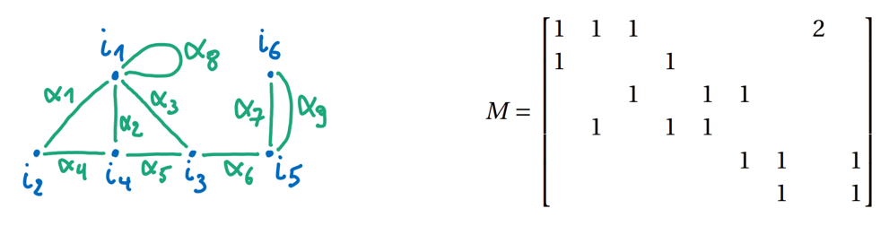

## Matrice d'incidence :
La matrice d’incidence d’un graphe $ G=(n,R)$ est la matrice de genre $ |N|\times|R|$ dont chaque entrée $ (i,\alpha)\in N\times R$ vaut :
- $ 2$ si l’arête $ \alpha$ est une boucle sur le nœud $ i$,
- $ 1$ si $ \alpha$ relie $ i$ à un autre nœud,
- $ 0$ si $ \alpha$ n’est pas incidente à i.

***Exemple(s) :***
1.

---

## Matrice Adjacente :
La matrice d’adjacence $ A$ est de genre $ |N|\times|N|$ : 
- $ a_{i,j}:=$  nombre d’arêtes reliant $ i$ et $ j$ si $ i \neq j$ 
- $ a_{i,i}:=$ deux fois le nombre de boucles sur $ i$

***Exemple(s) :***
1.

***Propriétés/Théorèmes :***
- 2.1 : $ \sum_{j\in N}a_{i,j}=\sum_{j\in N}a_{j,i}=\text{deg}(i)$ La somme des termes sur une lignes ou une colonne correspond au degré du nœud associé à cette ligne/colonne.
- 2.2 : $ \sum_{(i,j)\in N^{2}}a_{i,j}=2|R|$ La somme de tous les éléments de la matrice est égal au double du nombre d'arêtes dans le graphe.
- 2.3 : $ \sum_{i \in N}\text{deg}(i)=2|R|$ La somme des degrés des nœuds d'une graphe est égal au double du nombre d'arêtes dans le graphe.

---

